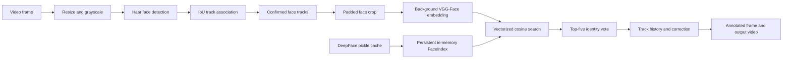

# Celebrity Face Recognition in Video

A local computer-vision prototype that detects, tracks, and identifies celebrity faces in video.
It combines OpenCV video processing and face detection with DeepFace embeddings, temporal voting,
and an in-memory NumPy search index.

> **Status:** v0.1 prototype. Built as an exploration of practical face recognition rather than as
> a production biometric system.

## What It Demonstrates

- Frame-by-frame video ingestion and annotated video export with OpenCV
- Multi-face detection using a Haar cascade
- Lightweight object tracking through intersection-over-union (IoU) matching
- Track confirmation, expiry, and fair recognition scheduling
- Background recognition with a `ThreadPoolExecutor`
- VGG-Face embeddings generated through DeepFace
- Vectorized cosine-distance search across approximately 25,800 reference images
- Temporal voting and periodic identity correction
- Reproducible database creation from LFW and Celebrity-1000

## Architecture



The main video loop stays responsive by submitting one recognition job at a time. Detection and
tracking continue while the worker generates a query embedding. Confirmed tracks are scheduled
fairly by recognition-attempt count and are periodically rechecked so an early prediction is not
permanent.

## Performance Work

DeepFace's standard `find()` path became the primary bottleneck after the database grew. Each call
reloaded a roughly 910 MB pickle cache and compared the query against 25,793 embeddings.

A representative local test produced:

| Search path                              | Approximate query time |
| ---------------------------------------- | ---------------------: |
| Repeated `DeepFace.find()`               |          12-15 seconds |
| Persistent `FaceIndex` with NumPy search |      0.12-0.17 seconds |

The optimized path loads the cache once at startup (approximately seven seconds in the same test),
normalizes its embeddings into a `float32` matrix, and performs cosine search with one matrix-vector
multiplication. DeepFace is still responsible for generating the query embedding and supplying the
model-specific verification threshold.

These are development measurements, not a formal benchmark; results depend on hardware, database
size, and video quality.

## Repository Structure

| File              | Responsibility                                                              |
| ----------------- | --------------------------------------------------------------------------- |
| `read_video.py`   | Video loop, detection, scheduling, recognition results, drawing, and export |
| `face_track.py`   | Track state and IoU calculation                                             |
| `face_recog.py`   | Persistent embedding index, cosine search, and identity voting              |
| `make_data.py`    | Downloads and exports Labeled Faces in the Wild into identity folders       |
| `extract_data.py` | Converts Celebrity-1000 Parquet rows into normalized identity folders       |

Large datasets, generated embeddings, source videos, and annotated outputs are intentionally excluded
from Git.

## Technology

The project was developed with Python 3.12 and the following principal packages:

- DeepFace 0.0.100
- OpenCV 4.13.0
- NumPy 2.2.3
- pandas 2.2.3
- scikit-learn 1.7.1
- Hugging Face Datasets 5.0.1
- Pillow 11.0.0

## Setup

```bash
git clone https://github.com/ayaannasim9/FaceRecognition.git
cd FaceRecognition

python3 -m venv .venv
source .venv/bin/activate

python3 -m pip install \
  deepface opencv-python numpy pandas pillow scikit-learn datasets
```

DeepFace downloads VGG-Face model weights on first use.

## Prepare the Reference Database

The runtime database uses one folder per identity:

```text
face_db/
├── Jenna_Ortega/
│   ├── dataset_0001.jpg
│   └── dataset_0002.jpg
├── Keanu_Reeves/
├── Timothee_Chalamet/
└── Winona_Ryder/
```

### 1. Export LFW

```bash
python3 make_data.py
```

This uses scikit-learn's Labeled Faces in the Wild loader and keeps identities with at least three
images.

### 2. Download Celebrity-1000

Download the [Celebrity-1000 Parquet file](https://huggingface.co/datasets/tonyassi/celebrity-1000)
to:

```text
datasets/celebrity_1000/train-00000-of-00001.parquet
```

Then export it:

```bash
python3 extract_data.py
```

The exporter writes all 18,184 images into normalized folders. Accent and punctuation variants such
as `Timothee Chalamet` and `Timothée Chalamet` are merged into one identity.

### 3. Build DeepFace Embeddings

The optimized runtime expects DeepFace's embedding cache to exist. Build it once with the same model,
detector, alignment, and normalization settings used by `FaceIndex`:

```bash
python3 - <<'PY'
from pathlib import Path
from deepface import DeepFace

extensions = {".jpg", ".jpeg", ".png", ".webp"}
query = next(
    path for path in Path("face_db").glob("*/*")
    if path.suffix.lower() in extensions
)

DeepFace.find(
    img_path=str(query),
    db_path="face_db",
    model_name="VGG-Face",
    detector_backend="skip",
    normalization="base",
    silent=False,
)
PY
```

The first build can take a long time for the full database. DeepFace writes the completed cache to
`face_db/ds_model_vggface_detector_skip_aligned_normalization_base_expand_0.pkl`.

## Run It

### Still-image search

Set `QUERY_IMAGE` in `face_recog.py`, then run:

```bash
python3 face_recog.py
```

### Video recognition

Set `VIDEO_PATH` in `read_video.py`, then run:

```bash
python3 read_video.py
```

Press `q` to stop playback. The processed video is written to `annotated_video.mp4`.

## Current Detection and Tracking Configuration

| Setting               |       Value | Purpose                                          |
| --------------------- | ----------: | ------------------------------------------------ |
| Detection scale       |       `0.5` | Reduces detection cost                           |
| Minimum face size     |    `120 px` | Rejects small detections                         |
| Cascade scale factor  |       `1.1` | Controls image-pyramid granularity               |
| Minimum neighbors     |        `11` | Suppresses weak Haar detections                  |
| IoU threshold         |       `0.3` | Associates detections with active tracks         |
| Confirmation hits     |         `5` | Filters short-lived false detections             |
| Maximum missed frames |        `80` | Retains tracks through detector gaps             |
| Recognition interval  | `30 frames` | Limits repeated recognition work                 |
| Crop padding          |       `20%` | Preserves useful context around tight Haar boxes |

These values were tuned empirically and remain video-dependent.

## Design Decisions

### Detection, tracking, and recognition are separate

OpenCV detects candidate faces, `FaceTrack` maintains temporal identity, and DeepFace performs
recognition. Keeping these responsibilities separate made it possible to tune false-positive handling,
tracking persistence, and recognition frequency independently.

### Recognition runs outside the video loop

Embedding generation is CPU-intensive. A single background worker avoids blocking every frame while
also preventing several TensorFlow inference jobs from competing for memory and compute.

### Tracks require temporal evidence

A detection must persist before it is drawn or recognized. Recognition results also pass through a
bounded vote history, reducing one-frame label changes. Named tracks remain eligible for periodic
rechecks, allowing later evidence to correct an early decision.

### Database search is kept in memory

The DeepFace cache is deserialized once. Database embeddings and identities remain positionally
aligned in NumPy arrays, and normalized vectors make cosine distance equivalent to one matrix-vector
operation.

## Known Limitations

- Haar cascades favor frontal faces and can produce false positives or miss profile views.
- Recognition quality changes significantly with lighting, age, makeup, blur, compression, and pose.
- VGG-Face confused Winona Ryder with visually similar identities in one overexposed interview while
  recognizing her correctly in clearer footage.
- Celebrity-1000 does not include every relevant person; Catherine O'Hara was absent during testing.
- Majority voting among the five nearest reference images can favor identities with repetitive or
  unusually similar images.
- The current cache format and threshold lookup depend on DeepFace implementation details.
- The in-memory index does not refresh if the database changes while the program is running.
- Loading approximately 25,800 VGG-Face embeddings has a substantial startup and memory cost.
- Paths and runtime settings are currently configured as module-level constants rather than CLI flags.
- The project has no automated test suite yet.

## Responsible Use

Face recognition is sensitive biometric technology. This project is intended for local education and
portfolio demonstration with public-figure footage. It should not be used for surveillance, access
control, consequential decision-making, or identifying private individuals without informed consent.

The image datasets are not redistributed in this repository. Their original terms, provenance, and
usage restrictions remain the responsibility of anyone downloading them. In particular, the
Celebrity-1000 dataset card does not provide sufficiently clear image-level licensing for commercial
deployment.

## Potential Next Steps

- Compare ArcFace and Facenet512 against VGG-Face on difficult video frames
- Replace the Haar cascade with a modern detector and landmark alignment
- Add nested-box suppression or non-maximum suppression for persistent false positives
- Aggregate evidence across multiple high-quality crops per track
- Add confidence margins between the best and second-best identities
- Add command-line arguments and structured logging
- Add unit tests for IoU, voting, folder normalization, and vector search
- Package a small, legally redistributable demo dataset and sample video
